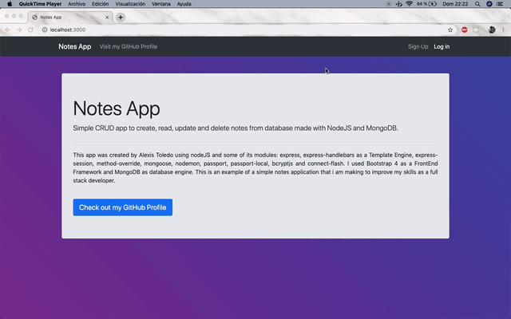
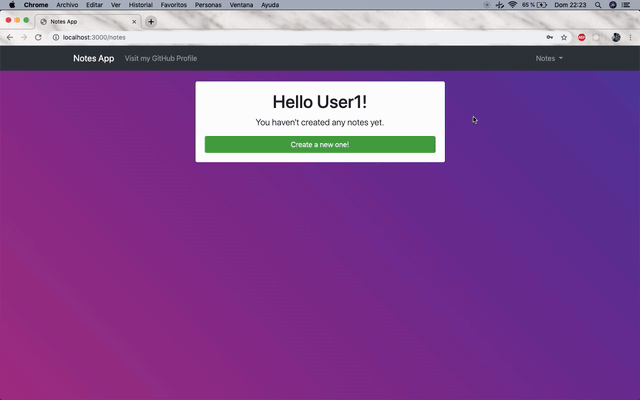
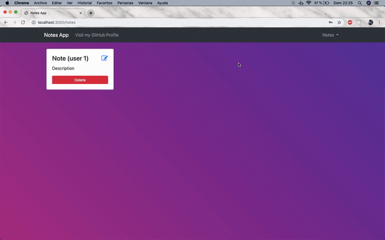

# register-login-crud
Simple app with register, login and CRUD (create-read-update-delete) developed in NodeJS + MongoDB.

# BACK-END
- Node JS
- NPM
- MongoDB

## Node Modules
* express
* express-handlebars
* express-session
* method-override
* mongoose
* nodemon
* passport
* passport-local
* bcryptjs
* connect-flash

# FRONT-END

- HTML5
- CSS3
- JavaScript
- Bootstrap 4
- Handlebars Template Engine

# How it works?

## Creating a new user

## CRUD

## Sessions
